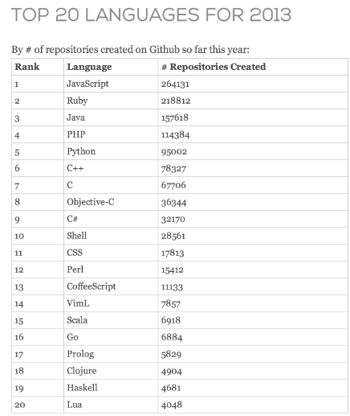

# A Brief History of JavaScript

The web has moved from being a primarily content-driven collection of
resources to a platform that allows developers to create rich applications that can be
asily accessed from a wide variety of computers and devices. JavaScript makes
this possible.

**Learning Objectives:**

* Understand the progression of JavaScript from a simple scripting language
  to a full-fledged development platform
* Compare JavaScript to other popular programming environments
* Discuss platforms that run JavaScript

**Section Reading:**

* <http://en.wikipedia.org/wiki/Javascript>

## What is JavaScript?

JavaScript has a bad rap as being *just a scripting language*, but in the last
several years it has developed into a powerful platform for delivering dynamic
content and applications over the web. It's arguably one of the best
envionments for deliveing true cross platform applications we have access to
today.

This year it became the most popular language on GitHub -
<http://githubpop.blogspot.com/> (which is web-centric, granted, but still an
interesting data point)

### Availability

Originally limited to use within web browsers, JavaScript is now available:

* as a powerful server side environment ([Node.js](http://nodejs.org/))
* a popular language for extending many applications (Adobe, ESRI)
* and there are even two recent projects to develop microcontrollers that
  run a scaled back version of JavaScript (<http://www.espruino.com/> and
  <http://technical.io/>)

## The Early, Dark Ages

Created in the mid-90s as a lightweight interpreted language (as opposed to
compiled). The initial use was primarily to provide simple dynamic content
on web pages (drop menus, animations, etc).

However, early implementations were plagued with performance problems and
inconsistent implementations.

> It's important to keep in mind that *JavaScript* has next to nothing to do
> with *Java*. The latter is an object oriented programming language that is
> currently maintained by Oracle.

## ECMAScript

Eventually the language was standardized as *ECMAScript*. In this respect
ECMAScript refers to the language specification, and JavaScript to
implementations of that the language.

* *ECMAScript 3* - Earliest version that provided a full-featured runtime
  environment
* *ECMAScript 4* - Abandoned due to conflicts within the group
* *ECMAScript 5* - The current version for most environments, the birth of
  *modern* JavaScript
* *ECMAScript 6* - Current draft version that adds many long awaited
  concepts such as modules and generators. Referred to as *Harmony*

The name *ECMAScript* is rarely referred to in practice, typically only
when referring to the availability of new functionality.

## Modern JavaScript

The development of AJAX (Asynchronous JavaScript and XML) marked a new era
in client side development. This allowed web pages to request smaller
amounts of data from the server and only update a portion of a page instead
of refreshing everything.

Then in 2008 Google released the Chrome browser which included the V8
JavaScript runtime. This provided the first high powered runtime for the
language that layed the foundation for creating truly powerful applications.

Ever since, there has been huge amount of competition, improvement, and
innovation between Google, Microsoft, and Mozilla to develop better and
better JavaScript runtimes.

## Language Features

JavaScript shares a C-like basic syntax with Java and C#, and borrows
concepts from many other languages.

Unlike Java and .NET, the JavaScript community drives a large portion of the
innovation and change in the language. Part of this is due to the flexible
nature of the language that allows for extension and modification without
rewriting the runtime internals.

An interesting aspect of this is that new language features are often
implemented by the community before being added to the language specification.
This model allows features to prove their usefulness prior to widescale
implementatation.

### Dynamic Typing

Java, C#, and many other languages are *staticly typed*, which means that
references/pointers have a particular type and the compiler will not allow
them to be assigned to objects that aren't the correct type. In addition,
objects and types are defined at compile time, and cannot be changed at
runtime (for the most part).

JavaScript is dynamically typed, which means there is no type checking by
the compiler or interpreter. Variables can refer to any object, and types
and object signatures can be changed at any time.

> This is often referred to as *duck-typing* - if it looks like a duck, and
> quacks like a duck, ...

### Event Driven

JavaScript is inherently single-threaded, but has powerful event-based
capabilities for implementing code that executes asynchronously.
This allows developers to create applications that continue to respond to
user input without the complexities of writing multi-threaded code.

In many ways this matches how we think about problems fairly well: *When it
is dark, turn on the lights*.

In contrast to the more declarative approach: *Is it dark yet? Is it dark yet?
Is it dark yet? Ok, then turn on the lights!*

> [Web Workers](https://developer.mozilla.org/en-US/docs/Web/Guide/Performance/Using_web_workers)
> are a relatively new feature that supports spawning separate threads to
> perform background or long-running tasks

## Libraries and Frameworks

Computing environments are not simply the programming language, but the
environment, runtime, and libraries that are available to write programs.

> Libaries keep you from having to reinvent the wheel each time when solving
> common problems

When we talk about *Java*, that includes not just the language itself but
the rich set of libraries and functionality that are included.

In this sense, JavaScript is is fairly lacking in terms of consistent
functionality. That is not to say there aren't a million JS libraries
available, but these are not part of a standardization effort.

In addition, many libraries like [jQuery](http://jquery.com/),
[Prototype](http://prototypejs.org/), [underscore](http://underscorejs.org/),
and others have such wide adoption that it is important to have at least a
cursory understanding of them.

